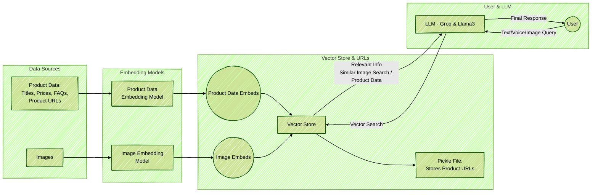

# Multimodal E-Commerce Customer Service Chatbot 🛍️

## Problem:
Customers interact with brands via text, images, and voice—but most chatbots only handle text. This creates a fragmented experience and limits accessibility.

## 🌐 Solution:
A state-of-the-art chatbot designed to handle multimodal inputs—including text, voice and images to provide personalized shopping recommendations and support across your e-commerce platform. It delivers personalized product recommendations, answers FAQs, and support across your e-commerce platform. 

## 🛠️ Tools & Technologies
- **LangChain:** To orchestrate various language processing tasks
- **Groq API:** For generating responses (Groq / Llama3)
- **Chainlit:** To build interactive, user-friendly chatbot interface
- **OpenAI-CLIP:** For image embeddings and similarity search
- **Speech Recognition:**  Google Speech-to-Text for voice input
- **Hugging Face Model:** For Text embeddings and similarity search


## 🔗 Workflow Diagram

1. **Text Input:** Users type queries, and the chatbot responds with product suggestions or FAQ answers.
2. **Image Input:** Using AI models like CLIP, the chatbot analyzes uploaded images (like product photos) to find similar items.
3. **Voice Input:** Integrated speech-to-text library lets users speak their queries which makes interactions smooth and accessible.




## Installation
This project uses Poetry for dependency management and packaging. Follow these steps to set up your environment:
1. **Clone the repository:**

   ```bash
   git clone https://github.com/emanalytic/MultiModal-E-Commerce-Customer-Support-Chatbot.git
   cd MultiModal-E-Commerce-Customer-Support-Chatbot
   ```
2. **Install Poetry:** (if not already installed)
   ```bash
   pipx install poetry
   ```
3. **Install project dependencies:**
   ```bash
   poetry install
   ```
## Running the Project
4. **Set up your environment variables:**
   ```bash
   GROQ_API_KEY= your_api_key_here  
   ```
5. **Run the Chainlit App locally:**
   ```bash
   poetry run chainlit run backend/chainlit_ui.py -w
   ```
   *For voice mode, run the app via terminal with `app.py` using Poetry as well.*

